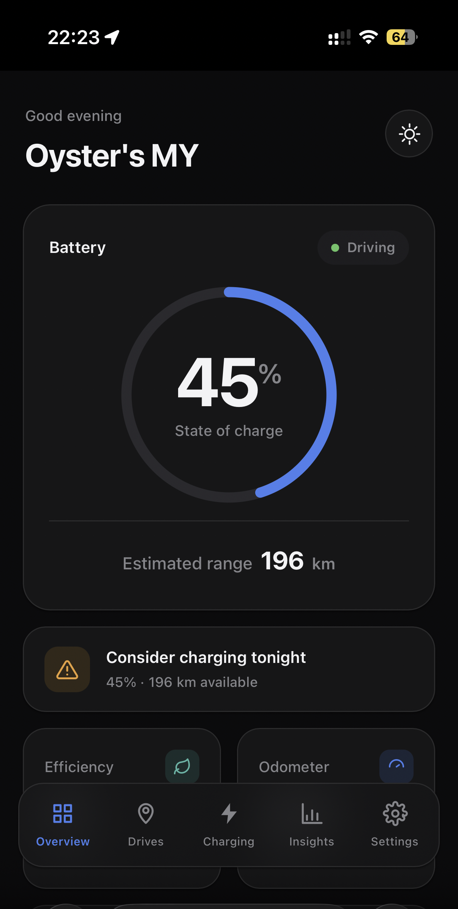
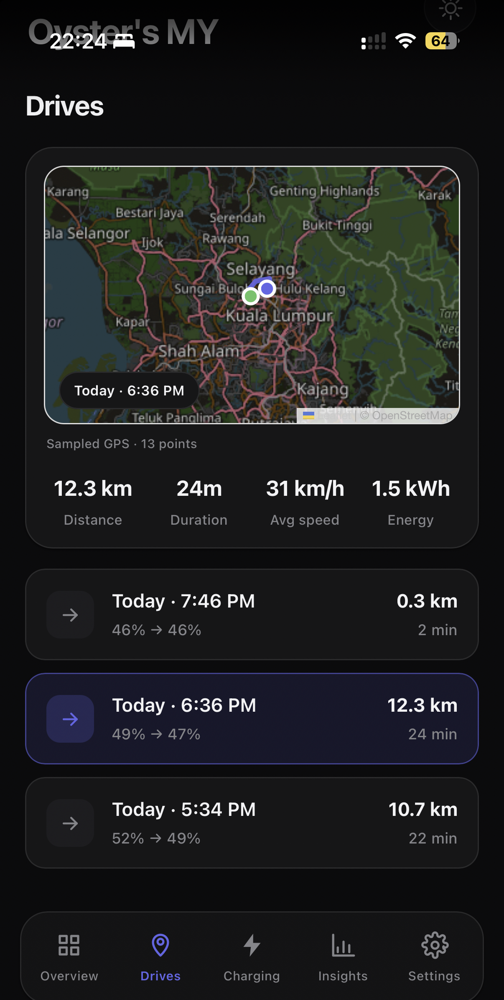
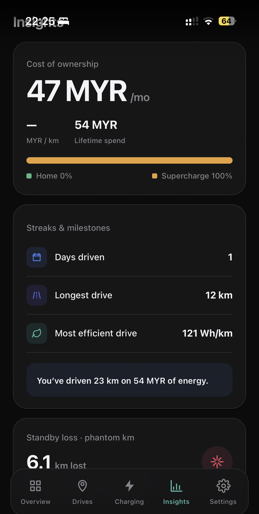

# tesboard

A **read-only** personal dashboard for your Tesla, built on the official **Tesla Fleet API**. It tracks your **charging history**, **per-charge cost + drivable range**, and **drive records** — and it **never sends commands to your car** (no lock/unlock, no climate, no charging control), so it stays well clear of Tesla's signed-command protocol and virtual-key pairing.

> Built with [TanStack Start](https://tanstack.com/start) (React 19, SSR) and deployed to [Cloudflare Workers](https://workers.cloudflare.com/), with [Supabase](https://supabase.com/) Postgres for storage and auth. It is **single-user** by design — you deploy your own copy for your own car.

---

## Screenshots

<table>
  <tr>
    <td align="center" width="33%"><br><sub><b>Overview</b><br>battery, estimated range, quick stats</sub></td>
    <td align="center" width="33%"><br><sub><b>Drives</b><br>reconstructed trips with a GPS map</sub></td>
    <td align="center" width="33%"><br><sub><b>Insights</b><br>cost of ownership, efficiency, standby loss</sub></td>
  </tr>
</table>

---

## How it works (the one thing to understand)

The Fleet API has **no trip-history endpoint** and **only bills Supercharger sessions**. So tesboard is not an API proxy — it's a **sleep-aware poller → Postgres → sessionization engine**:

- A **Cloudflare Cron Trigger** polls `vehicle_data` every couple of minutes and writes snapshots to Postgres. From those snapshots it reconstructs **charge sessions** and **drives**.
- The UI reads **only from Postgres** and **never wakes the car**. (A `vehicle_data` read on a sleeping car returns `408` and does *not* wake it; tesboard never calls `wake_up`.)
- **Supercharger cost** is authoritative, pulled from `/dx/charging/history`. **Home-charge cost is computed** = `energy_added × your rate × loss_factor`. A `cost_source` field keeps billed vs computed costs visually distinct.

Because drives and home charges only accrue **while the poller is running**, there is no backfill — history starts the day you deploy.

---

## What you'll need

| Requirement | Why |
| --- | --- |
| A **Tesla** on your Tesla account | The thing being tracked. |
| A **[Tesla Developer](https://developer.tesla.com/) app** | OAuth client ID/secret + Fleet API access. |
| A **Cloudflare** account | Hosts the Worker + runs the cron poller. A custom domain or `*.workers.dev` subdomain over **HTTPS** is required. |
| A **[Supabase](https://supabase.com/)** project | Postgres (data) + Auth (your login). Free tier is fine. |
| **Node 20+** and **[pnpm](https://pnpm.io/)** | Local build/migrate tooling. |
| **[Wrangler](https://developers.cloudflare.com/workers/wrangler/)** | Cloudflare CLI (installed as a dev dependency). |

A read-only Fleet API app runs against Tesla's ~**$10/month** API credit; the default `*/2` poll cadence is tuned to stay within it. See [Cost & cadence](#cost--cadence).

---

## Deploy your own

The steps below take you from a fresh clone to a live dashboard. Most of the friction is Tesla's partner-registration flow — that's inherent to the Fleet API, not to this app.

### 1. Clone and install

```bash
git clone https://github.com/<you>/tesboard.git
cd tesboard
pnpm install
```

### 2. Create your Supabase project

1. Create a project (note its **region** and **project ref** — the `xxxx` in `https://xxxx.supabase.co`).
2. **Disable public sign-ups:** Authentication → Providers/Settings → turn **off** "Allow new users to sign up". tesboard provisions its single login out of band.
3. Grab your **Project URL**, **anon key**, and **service-role key** (Settings → API), plus the **session-pooler** and **direct** connection strings (Settings → Database → Connection string).

### 3. Register a Tesla Fleet app

At [developer.tesla.com](https://developer.tesla.com/):

- **Scopes:** `openid offline_access vehicle_device_data vehicle_location vehicle_charging_cmds`
  *(`vehicle_charging_cmds` is required to **read** `/dx/charging/history`. tesboard sends zero commands — it stays read-only with no virtual key.)*
- **Allowed Origin:** your root HTTPS domain (e.g. `https://tesboard.<your-subdomain>.workers.dev`).
- **Allowed Redirect URI:** `https://<your-domain>/api/auth/tesla/callback`.
- Copy the **Client ID** and **Client Secret**.

### 4. Generate the Tesla public key

Tesla requires a hosted EC public key even for read-only apps.

```bash
mkdir -p secrets public/.well-known/appspecific
openssl ecparam -name prime256v1 -genkey -noout -out secrets/private-key.pem
openssl ec -in secrets/private-key.pem -pubout -out public/.well-known/appspecific/com.tesla.3p.public-key.pem
```

The **public** key ships in `public/` and is served by Cloudflare at
`https://<your-domain>/.well-known/appspecific/com.tesla.3p.public-key.pem` once you deploy.
The **private** key stays in `secrets/` (gitignored) and is **not needed at runtime** for read-only use.

### 5. Configure Cloudflare

```bash
cp wrangler.jsonc.example wrangler.jsonc
```

Edit `wrangler.jsonc` and replace every `<PLACEHOLDER>`:

- `name` — your worker name.
- `APP_ORIGIN`, `TESLA_REDIRECT_URI`, `TESLA_APP_DOMAIN` — your HTTPS domain.
- `TESLA_CLIENT_ID`, `SUPABASE_URL`, `SUPABASE_ANON_KEY` — from steps 2–3.
- `TESLA_FLEET_BASE_URL` / `TESLA_OAUTH_AUDIENCE` — match your Tesla **region** (the placeholder is NA; the app also resolves this per-account at link time).

Create the **Hyperdrive** binding (runtime DB access goes through it — raw Postgres TCP hangs inside the Workers runtime):

```bash
wrangler hyperdrive create tesboard-db \
  --connection-string="postgresql://postgres.<YOUR_SUPABASE_REF>:<DB-PASSWORD>@aws-1-<YOUR_REGION>.pooler.supabase.com:5432/postgres"
```

> ⚠️ Use the Supabase **session pooler (port `5432`)** or the direct connection — **never** the `6543` transaction pooler. Hyperdrive holds long-lived connections that the transaction pooler tears down per-transaction, causing a connection storm.

Paste the returned id into `wrangler.jsonc` → `hyperdrive[0].id`.

### 6. Set secrets

Set the build-time client env (baked into the browser bundle by Vite):

```bash
cp .env.example .env          # fill in VITE_SUPABASE_URL + VITE_SUPABASE_ANON_KEY
```

Set the runtime **secrets** on the Worker:

```bash
wrangler secret put TESLA_CLIENT_SECRET     # from step 3
wrangler secret put TOKEN_ENCRYPTION_KEY    # 32-byte base64; encrypts Tesla tokens at rest
wrangler secret put CRON_TRIGGER_SECRET     # guards the manual /api/cron/poll route
wrangler secret put SESSION_SECRET          # signs OAuth state
# optional, only if you later need to sign anything:
# wrangler secret put TESLA_PRIVATE_KEY_PEM
```

Generate a key with e.g. `openssl rand -base64 32`.

> `SUPABASE_SERVICE_ROLE_KEY` is **not** a Worker secret — it's only used locally by `pnpm user:create`. Put it in `.dev.vars` (see `.dev.vars.example`).

### 7. Migrate the database

Point drizzle-kit at your **direct/session** connection (DDL can't run over the transaction pooler), then migrate:

```bash
export DIRECT_URL="postgresql://postgres.<YOUR_SUPABASE_REF>:<DB-PASSWORD>@aws-1-<YOUR_REGION>.pooler.supabase.com:5432/postgres"
pnpm db:migrate
```

This creates the tables (all with row-level security enabled as a lockdown) defined in `src/server/schema.ts`.

### 8. Deploy

```bash
pnpm deploy   # vite build && wrangler deploy
```

Verify the public key is live:

```bash
curl https://<your-domain>/.well-known/appspecific/com.tesla.3p.public-key.pem
```

### 9. Register your Tesla partner account

A one-time call that proves you own the domain hosting the public key:

```bash
pnpm tesla:register --domain=<your-public-host>
```

(Skipping this → Tesla returns `412`. A `412` can also mean the wrong region.)

### 10. Create your login and sign in

```bash
pnpm user:create <your-email> <your-password>
```

Then open `https://<your-domain>`, sign in, click **Link Tesla** (the OAuth flow), and **set your electricity rate** (flat `$/kWh` + a loss factor ≈ `1.1`) so home-charge costs compute correctly.

That's it — the poller now runs automatically on Cloudflare Cron Triggers, and data starts accumulating.

---

## Local development

```bash
cp .dev.vars.example .dev.vars   # fill in secrets + the local Hyperdrive connection string
pnpm dev                         # Vite dev server on http://localhost:3001
```

`pnpm dev` loads `.dev.vars` into the process env (via `dotenv-cli`) so the Cloudflare Vite plugin can read `CLOUDFLARE_HYPERDRIVE_LOCAL_CONNECTION_STRING_HYPERDRIVE`.

Other scripts:

| Command | What it does |
| --- | --- |
| `pnpm build` | Production build (client + SSR worker bundle). |
| `pnpm preview` | Preview the production build. |
| `pnpm test` | Run the Vitest suite. |
| `pnpm db:generate` | Regenerate SQL migrations from `src/server/schema.ts`. |
| `pnpm db:migrate` | Apply migrations (needs `DIRECT_URL`). |
| `pnpm generate-routes` | Regenerate the TanStack route tree. |

---

## Environment variables

All variables are documented in **`.env.example`** (build-time, browser) and **`.dev.vars.example`** (runtime secrets, local). The split:

- **Build-time, public (`VITE_*`)** — baked into the client bundle: `VITE_SUPABASE_URL`, `VITE_SUPABASE_ANON_KEY`. *(Never `VITE_`-prefix a secret.)*
- **Runtime, non-secret** — live in `wrangler.jsonc` → `vars`: `APP_ORIGIN`, `TESLA_CLIENT_ID`, `TESLA_REDIRECT_URI`, `TESLA_APP_DOMAIN`, `TESLA_FLEET_BASE_URL`, `TESLA_OAUTH_AUDIENCE`, `SUPABASE_URL`, `SUPABASE_ANON_KEY`.
- **Runtime, secret** — `wrangler secret put`: `TESLA_CLIENT_SECRET`, `TOKEN_ENCRYPTION_KEY`, `CRON_TRIGGER_SECRET`, `SESSION_SECRET`, optional `TESLA_PRIVATE_KEY_PEM`.
- **Tooling only** — `SUPABASE_SERVICE_ROLE_KEY` (for `pnpm user:create`), `DIRECT_URL`/`DATABASE_URL` (for migrations).

Tesla tokens are **AES-256-GCM encrypted at rest** with `TOKEN_ENCRYPTION_KEY`. Tesla rotates the refresh token on every refresh, so the token store overwrites it atomically — stale reuse breaks the chain and forces a re-link.

---

## Cost & cadence

Cloudflare's minimum cron granularity is **1 minute**. The default `*/2 * * * *` (poll) + `0 * * * *` (reconcile Supercharger billing) balances drive resolution against Tesla's ~$10/month Fleet API credit. Tune the cadence in `wrangler.jsonc` → `triggers.crons`: poll more often for finer drives (more API calls, more cost), or less often to save.

---

## Security notes

- **Single-user:** there is no public sign-up route; the login page only signs in, and the one account is created via `pnpm user:create`. Also disable sign-ups in Supabase Auth (step 2) so the anon key can't hit the signup endpoint directly.
- **App-enforced isolation:** every data query filters by `user_id`. Row-level security is enabled (no policies) on every table so the public anon key can't read them via Supabase's auto-generated PostgREST API.
- **Read-only by design:** the app holds the scopes needed to *read* charging history; it issues no vehicle commands and has no virtual key paired.

---

## Architecture & deeper docs

- **`docs/design/tesla-dashboard.md`** — full design: data model, Tesla API surface, the poller/sessionization engine, risks, and the feature roadmap.
- **`CLAUDE.md` / `AGENTS.md`** — durable project context for AI coding agents (Claude Code, etc.).

---

## License

[MIT](./LICENSE) — provided as-is. This project is not affiliated with, endorsed by, or sponsored by Tesla, Inc. "Tesla" is a trademark of Tesla, Inc.
